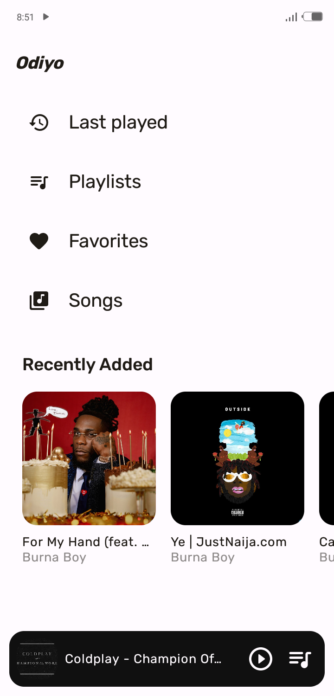
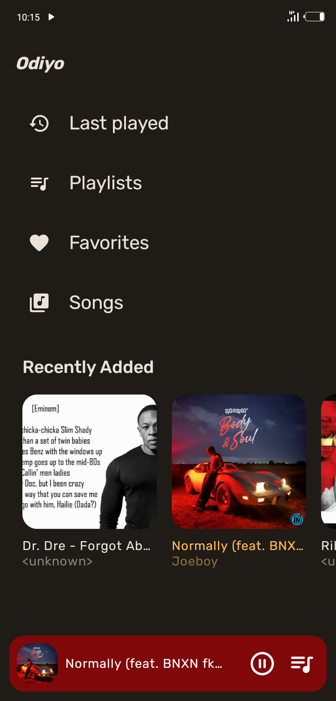
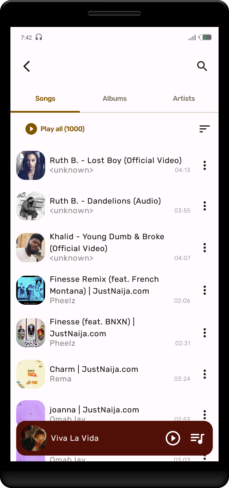
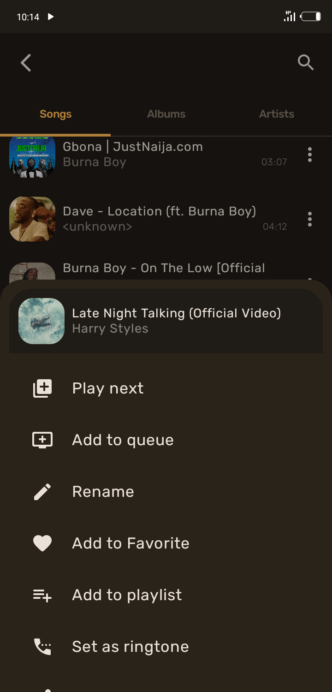

# Odiyo
An offline music streaming app.

## Screenshots
|:--:|:--:|:--:|:--:|:--:|:--:|:--:|
|:--:|:--:|:--:|:--:|:--:|:--:|:--:|
||||||||

## Features
* Listen to all songs on your device's local storage
* Create playlists of your favorite songs
* Favorite your best songs
* Enjoy songs from app-curated playlists
* Edit current music queue
* Save music queue to playlist
* Rename, share or delete songs
* Appealing UI design with dynamic colors

***Still under development 🛠***

## Developed with
* [Jetpack Compose](https://developer.android.com/jetpack/compose) - Jetpack Compose is Android’s recommended modern toolkit for building native UI.
* [Media3](https://developer.android.com/guide/topics/media/media3) - Enables Android apps display rich audio and visual experience.
* [Coil](https://github.com/coil-kt/coil) - An Android image loading library backed by Kotlin Coroutines.
* [Dagger-Hilt](https://developer.android.com/training/dependency-injection/hilt-android) - Reduces boilerplate of doing manual dependency injection in your project.
* [Navigation Compose Animation](https://google.github.io/accompanist/navigation-animation) - Offers a way to add custom transitions to composables in Navigation Compose.
* [Datastore](https://developer.android.com/topic/libraries/architecture/datastore) - Jetpack DataStore is a data storage solution that allows you to store key-value pairs asynchronously.
* [Room Database](https://developer.android.com/training/data-storage/room) - A persistent local data storage library.
* [Material3](https://m3.material.io) - Google's latest design system with adaptable components and tools that support the best practices of user interface design for building beautiful apps.
* [Compose Animation](https://developer.android.com/jetpack/compose/animation) - API for implementing various animations in your app's UI for a smooth user experience.
* [Kotlin Coroutine](https://kotlinlang.org/docs/coroutines-overview.html) - For executing tasks asynchronously.
* [Stateflow](https://developer.android.com/kotlin/flow/stateflow-and-sharedflow) - An observable state-holder that emits data stream to its collectors - updating the UI incessantly.
* [ViewModel](https://developer.android.com/topic/libraries/architecture/viewmodel) - Stores UI-related data that isn't destroyed on UI changes.
* [Palette](https://developer.android.com/reference/androidx/palette/graphics/Palette) - A helper class to extract prominent colors from an image.